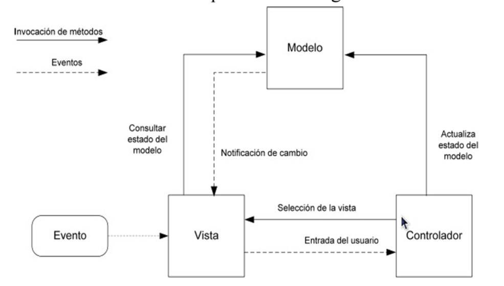
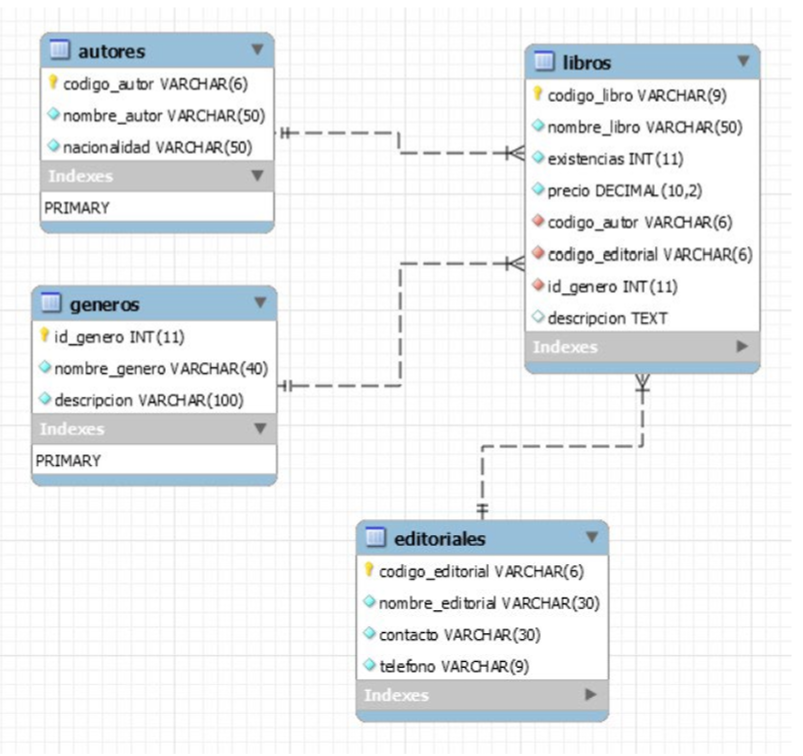

# MVC Django

Esta es una aplicación de ejemplo basada en el modelo MVC usando el framework Django.

## Descripción

El Objetivo de la app es un sistema de gestión de libros el cual tiene todos los mantenimientos para poder realizar las siguientes acciones: 
- Listar, Registrar, Editar y Eliminar Autores.
- Listar, Registrar, Editar y Eliminar Géneros.
- Listar, Registrar, Editar y Eliminar Libros.
- Listar, Registrar, Editar y Eliminar Editoriales.

### MVC Model



### DB Model



## Getting Started

Esta aplicación utiliza Django como framework de desarrollo web y mySql como motor de bases de datos. 

### Using Docker Compose

La aplicación cuenta con una configuración de contenedores para utilizar docker y docker compose, para ello solamente deberá correr el siguiente comando:

```bash
docker compose up
```

Después puede ir directamente a http://localhost:8000/

### Using Python + MySql

Sí desea utilizar directamente python puede utilizarlo así:

1. **(Opcional)** Cree un ambiente virtual

```bash
pipenv install
pipenv shell
```

1. **(Skip if using pipenv)** Instale las dependencias de python

```bash
pip install -r requirements.txt
```

2. Actualice el archivo **.env** con la configuración para conectarse a su base de datos

```
MYSQL_USER=<your-db-user>
MYSQL_PASSWORD=<your-db-user-password>
MYSQL_DATABASE=<your-db-database-name>
MYSQL_HOST=<your-db-hostname>
MYSQL_PORT=<your-db-port>
```

3. Sincronice su base de datos con los modelos de Django

```bash
python manage.py migrate
```

4. Levante el servidor

```bash
python manage.py runserver 0.0.0.0:8000
```

5. Visite http://localhost:8000/